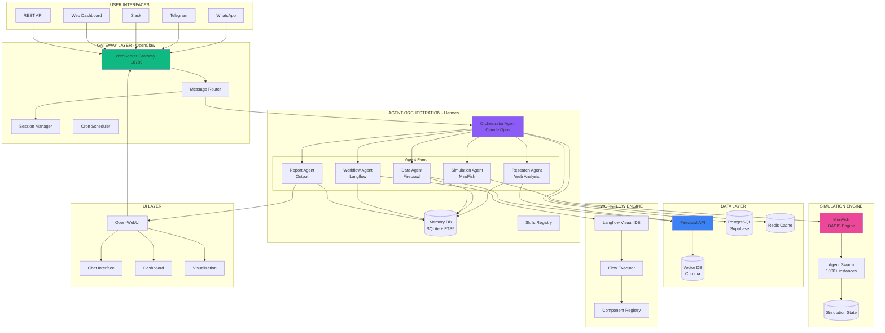
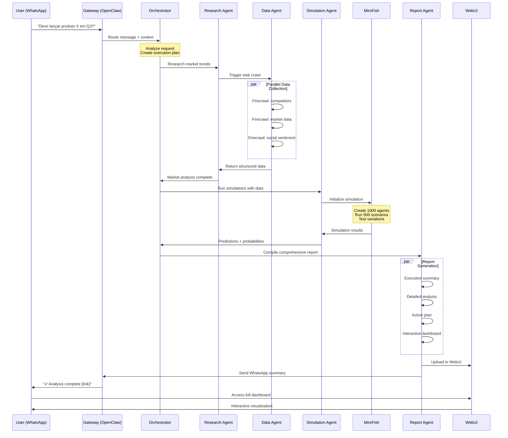
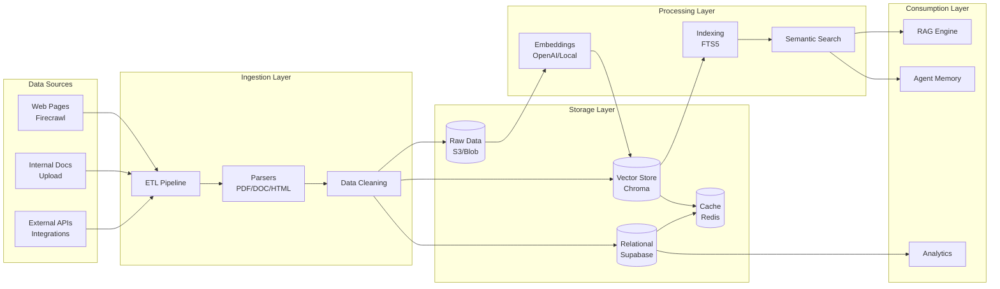
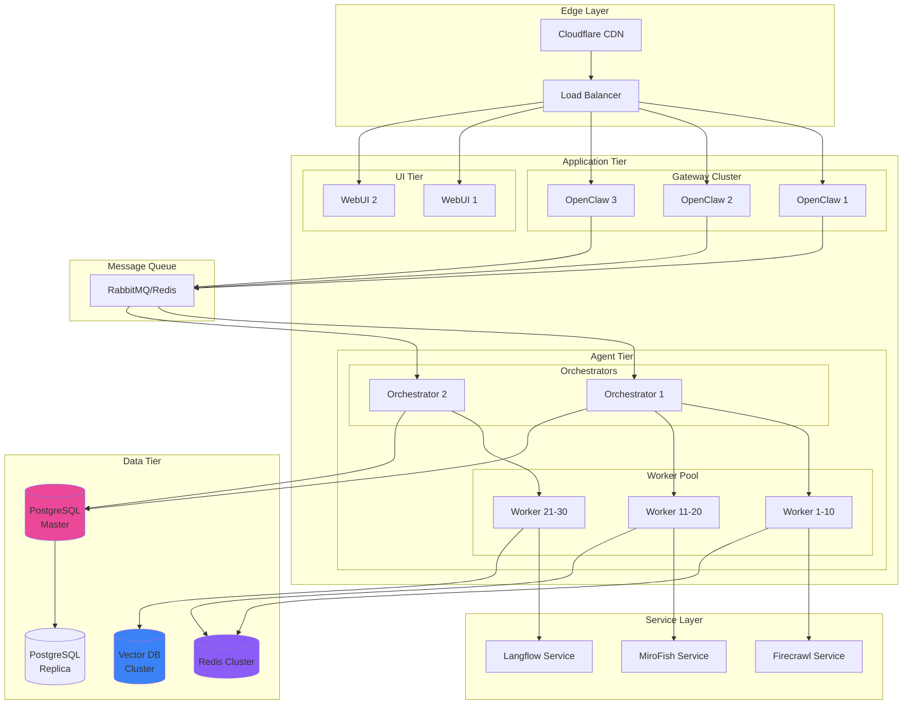
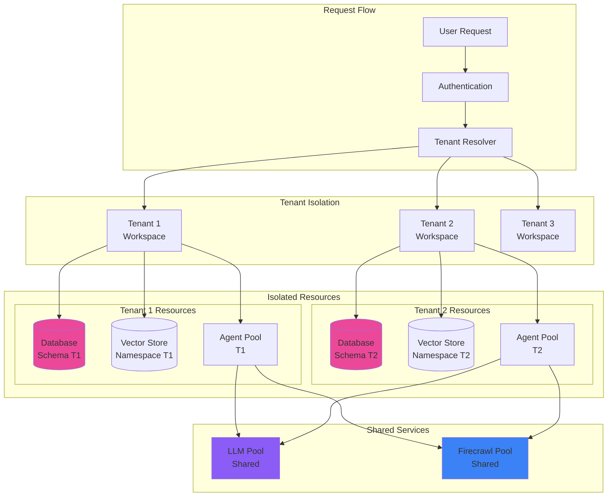
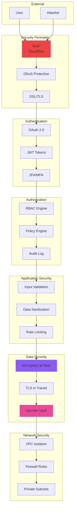
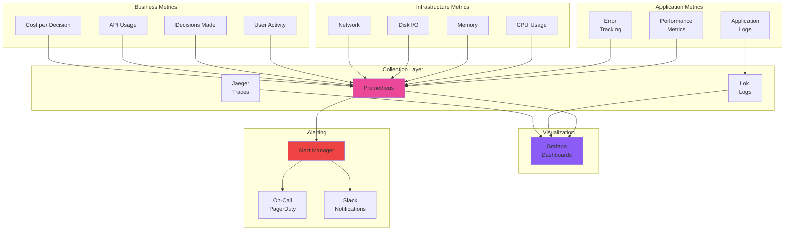

# SPIRIT - Diagrama de Arquitetura Técnica

## 1. VISÃO GERAL DO SISTEMA

## 2. FLUXO DE DECISÃO DETALHADO

## 3. ARQUITETURA DE DADOS

## 4. DEPLOYMENT ARCHITECTURE

## 5. MULTI-TENANT ARCHITECTURE

## 6. SECURITY ARCHITECTURE

## 7. MONITORING & OBSERVABILITY

## 8. CI/CD PIPELINE

```mermaid
graph LR
    subgraph "Development"
        DEV[Developer]
        GIT[Git Push]
    end

    subgraph "CI Stage"
        BUILD[Build]
        TEST[Unit Tests]
        LINT[Linting]
        SEC[Security Scan]
    end

    subgraph "CD Stage"
        CONTAINER[Docker Build]
        REG[Container Registry]
        DEPLOY[Deploy to K8s]
    end

    subgraph "Environments"
        STAGING[Staging]
        CANARY[Canary]
        PROD[Production]
    end

    subgraph "Validation"
        SMOKE[Smoke Tests]
        INTEGRATION[Integration Tests]
        MONITOR[Monitoring Check]
    end

    subgraph "Rollback"
        ALERT_FAIL[Alert on Failure]
        AUTO_ROLLBACK[Auto Rollback]
    end

    DEV --> GIT
    GIT --> BUILD
    BUILD --> TEST
    TEST --> LINT
    LINT --> SEC

    SEC --> CONTAINER
    CONTAINER --> REG
    REG --> DEPLOY

    DEPLOY --> STAGING
    STAGING --> SMOKE
    SMOKE --> CANARY
    CANARY --> INTEGRATION
    INTEGRATION --> MONITOR
    MONITOR --> PROD

    MONITOR --> ALERT_FAIL
    ALERT_FAIL --> AUTO_ROLLBACK
    AUTO_ROLLBACK --> CANARY

    style SEC fill:#ef4444
    style PROD fill:#10b981
    style AUTO_ROLLBACK fill:#ec4899
```

## TECH STACK SUMMARY

**Gateway:** OpenClaw (Node.js, WebSocket)
**Agents:** Hermes (Python 3.11+, SQLite)
**Simulation:** MiroFish (Python, OASIS)
**Data:** Firecrawl (REST API, Fire-engine)
**Workflow:** Langflow (Python, React)
**UI:** Open-WebUI (Svelte, Python)
**Database:** PostgreSQL (Supabase), Redis
**Vector:** Chroma/Qdrant
**Deployment:** Docker, Kubernetes
**Monitoring:** Prometheus, Grafana
**CI/CD:** GitHub Actions, ArgoCD
